# 洞察篇

## 前言

中国是世界的一部分，开源亦是。

> 绝不是徒劳。我把它看作是活的、不断发展的东西。我将世界文学视为一片森林，这里我想把文学比喻成盘根错节的树木，它让我们困惑的同时也在不断生长。那么，回到我常常提到的关于迷宫的意象，它就像是一座活的迷宫，不是吗？一个活的迷阵。也许迷宫这个词比迷阵还要神秘。
>
>  ———— 《博尔赫斯·最后的访谈》

## 2019年：最好的一年也是挑战的一年

|时间| 国内开源重大事件| 国际开源重大事件|
| --- | ---| ---|
| 1月| | Hadoop 巨头完成合并， 成为全球第二大开源软件公司|
| 3月| | SUSE 重回独立，成为业界最大的独立开源公司。  Apache 基金会成立 20 周年| 
|5月|美国针对华为的出口管制，引发关于开源是否受 EAR 影响的讨论   多名中国开发者入选 FFmpeg 决策委员会|Google 限制华为使用 Andriod  Oracle 与 Eclipse 基金会谈判失败，拒绝出让 JAVA 商标  F5 完成对 NGINX 的收购|
|6月|腾讯公布开源路线图，成立开源管理办公室 | |
| 7月||IBM 完成对 RedHat 的收购  GitHub 中断对部分受美国制裁对国家和地区的服务|
|8月|中国开源云联盟发布“木兰宽松许可证”（MulanPSL） 华为开源方舟编译器	|GNOME 和 KDE 在 Linux 桌面上联手合作   IBM 开源 Power，OpenPOWER 基金会加入 Linux 基金会|
|9月|阿里将开源升级为技术战略，成立开源技术委会 腾讯首次捐赠开源项目到 Apache 软件基金会|ApacheCon North America 召开，中国参会者及演讲者人数不但创新高，也超过其它类似的国际开源大会   RMS 从自由软件基金会与 MIT 离职|
|11月|开源实时操作系统 RT-Thread 获近亿元 B 轮融资	|甲骨文与谷歌官司继续：美最高法院同意复审 Java API 版权诉讼案   微软宣布加入 OpenJDK 项目  微软开源 exFAT 技术，支持 Linux 内核   昔日独角兽 Docker 资金紧张，卖掉 Docker Enterprise   怕被政治波及，RISC-V 基金会决定迁址瑞士   GitLab 声明限制招聘中国与俄罗斯程序员|
|12月|开源中国获得百度战略投资|GitHub 计划登陆中国，或将开设子公司|
红薯 - 2019 年中国开源生态报告
https://gitee.com/oschina/open_source_2019 

---

## 一、开源的全球发展
### 1.1 GitHub Octoverse Report ( October 1, 2018 to Sept 30, 2019)

开放源码是由全球维护者、开发人员、研究人员、设计师、作家等组成的团队构建的。平均而言，GitHub 上的每个开源项目今年有来自 41 个国家和地区的贡献者参与。自 2014 年以来，每年都看到更多来自美国以外的开源贡献。

去年，全球财富50强企业中有近 70%为开源做出了贡献。

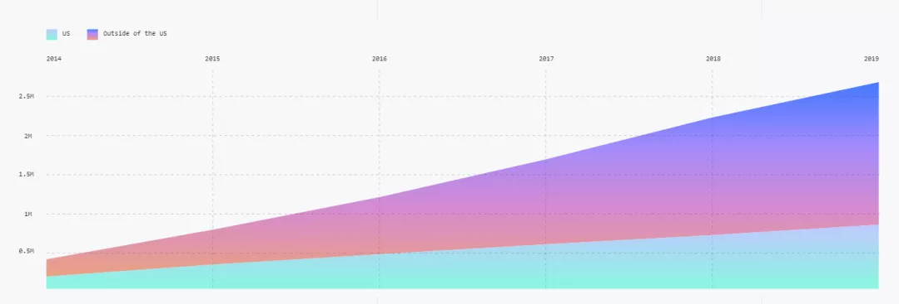

> 从数据来看，今年的整体贡献较去年增幅明显，而且增长较快的不仅仅是开源这一项。2019 年亚洲个人和公众贡献和开发者社区都发展迅猛。

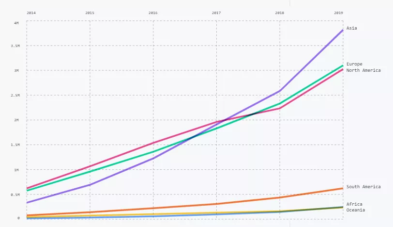

> 自 2014 年以来，越来越多的贡献者来自美国以外。亚洲的贡献者社区年度增速要超越欧洲和北美。与开源一样，整个社区的全球化趋势每年都在加剧。今年，公共和私人数据库的 80% 的贡献者来自美国以外。

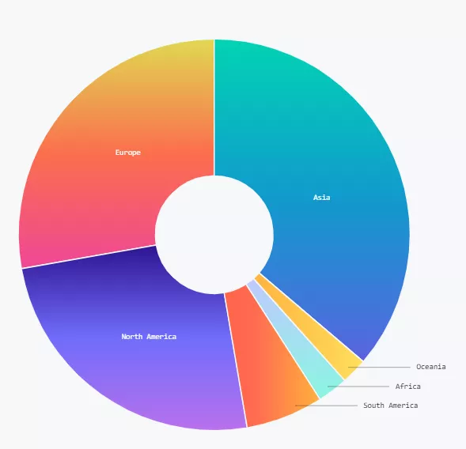

> 2019 年 GitHub 推出了免费的私人代码仓库，允许开发者在那些目前还没被大众关注的工作申请、业务项目或其他实验中按照自己的意愿进行使用。目前为止，已经形成了全球联动，甚至远在非洲的开发者都可以使用。自 2019 年 1 月发布起，80% 的私人代码仓库都是美国以外的开发者创立的。其中亚洲创建了 36%，开发者主要都来自于印度、中国和日本。
### 1.2 立足中国、贡献全球
> 亚洲总贡献中的 31% 来自中国，但是中国的开发者们却不仅仅只为本国做贡献。继美国之后，今年中国、印度和德国的开源使用速度加快。中国的开发者分叉和克隆的项目比去年多48%。

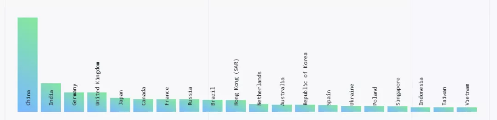

> 截至2018年，中国成为 GitHub 贡献排名第二的国家，排名仅次于美国

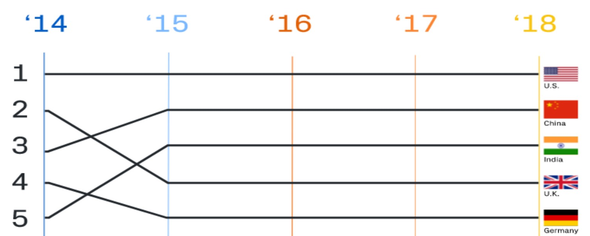

### 1.3 国际与国内组织开源投入

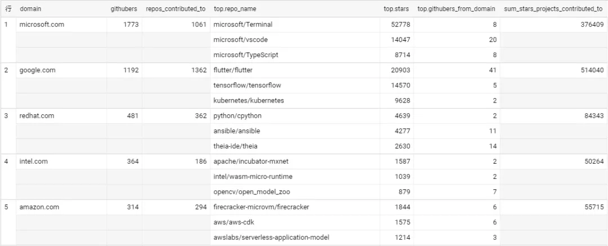
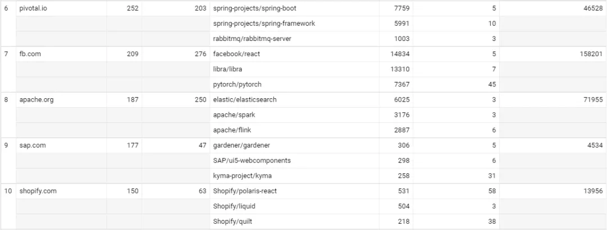
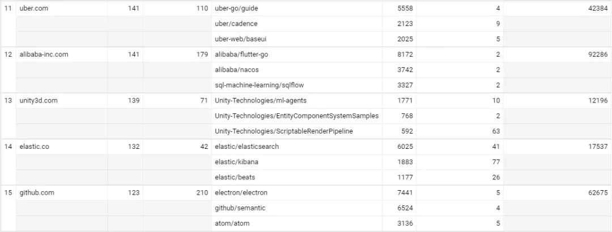

来源：[《2019 GitHub 开源贡献排⾏榜新鲜出炉！微软⾕歌领头，阿⾥跻身前 12！》](https://mp.weixin.qq.com/s?__biz=MzIxNjA5ODQ0OQ==&mid=2654701370&idx=1&sn=406ecc2752ab694d324255463cb49e6c&chksm=8c4114c4bb369dd2de067ae206e9aa740f96aae1f3a4d60fa73ac454215b5a686f3ce6beea96&mpshare=1&scene=1&srcid=&sharer_sharetime=1576239337354&sharer_shareid=50db726169328285261995c2c9f8bc31&key=776c40d5843ff79fba365d47c716bbf189d1cccd9927c175e743bc0863b6a49d5a5f4a3b87ee7b70331b5ae8c86704ac6e3d75c31df442b09794df6268abf24dca3f1d3c11e59574ee41ed6fe5b96463&ascene=1&uin=MjU2MDM4ODc4MA%3D%3D&devicetype=Windows+10&version=62070158&lang=zh_CN&exportkey=ATDBkdyUIqOwA%2FpOuCh7Wfs%3D&pass_ticket=oxBYNH0OHBuzJWAiumOYFK5V3WeR%2FKbdB5vVDikUZju%2Fao7DUEgkl6wY1r95ORBs)Doocs开源社区，2019.10

> 微软谷歌在开源贡献度上遥遥领先，位列 3-5 位的分别是 Redhat、Intel 和 Amazon；

> 国内大厂开源贡献度最高的当属阿里员工，排在第十二位，top 3 仓库分别是 flutter-go、nacos 和 sqlflow，所有项目共获得 stars 数超过 90,000。百度和腾讯则分列 21、23 位。

### 1.4 关于制裁
> GitHub 私有代码仓库 — 受制裁国家/地区的用户（如伊朗）目前无法访问，开发人员仍可以通过在公共项目上参与公共代码仓库，并参与全球开源软件社区。如果用户的私有代码仓库受到限制，GitHub 提供了将该代码仓库公开的选项，以便该国家/地区的用户仍可以访问其内容以进行个人通信。

国内许多 GitHub 用户担心我国未来也有可能遭到类似制裁。如果有此顾虑，可以考虑在国内进行镜像或选择类似托管平台。

## 二、中国开源产业发展现状
以下是中国企业及个人从应用、参与、贡献、捐赠到开始影响国内及全球开源格局，带进来、走出去的精彩历程的剪影。

### 2.1 开源技术的广泛应用
> 据 Gartner 调查显示，99%的组织在其 IT系统中使用了开源软件。 新兴技术领域开源技术应用尤其广泛。据中国信通院《云计算开源产业调查报告》，已经构建私有云的企业中，85.3%的企业表示已经应用了开源技术。

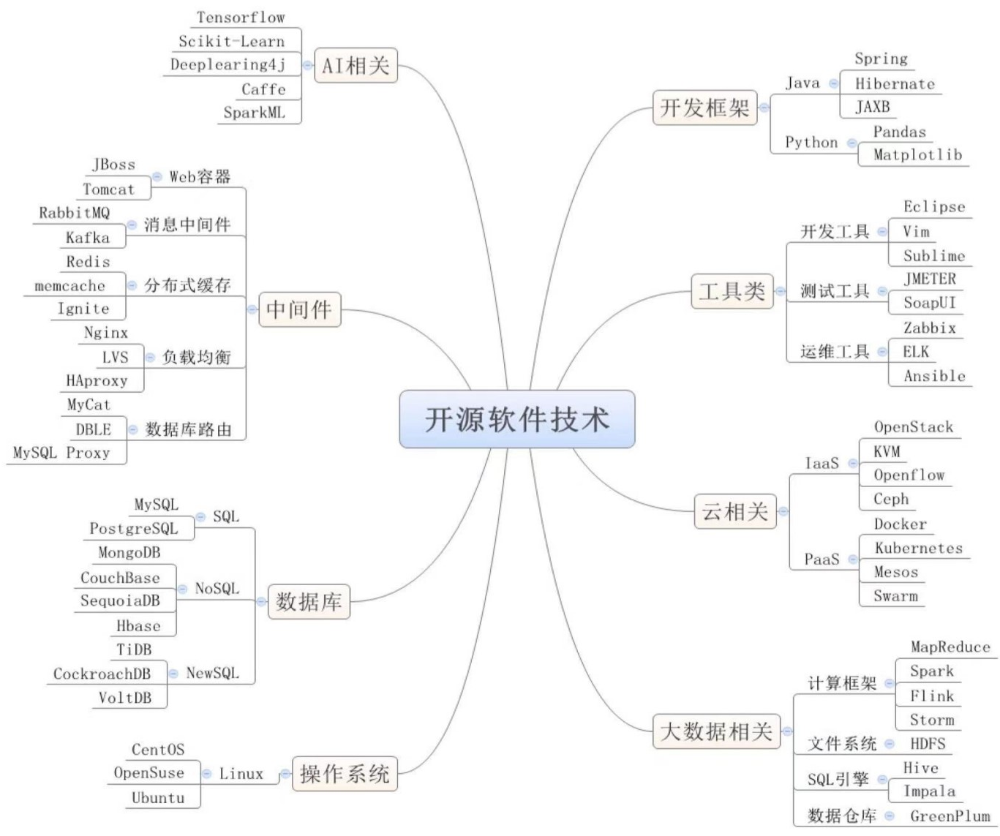

中国信通院云计算与大数据研究所所长-何宝宏（COSCon'19 主题演讲）

### 2.2 国内外开源项目对比

|领域|国际|国内|
|---|---|---|
|大数据|分布式系统基础架 Apache Hadoop   https://hadoop.apache.org/        分布式搜索引擎 Elasticsearch     https://www.elastic.co/cn/products/elasticsearch        ⼤数据查询引擎 PrestoDB     https://prestodb.io/     开源的⼤规模的可伸缩的数据存储系统 Crate     https://crate.io/ |	⼤规模并⾏ SQL 分析处理引擎 Apache HAWQ   https://hawq.apache.org/        阿⾥开源的数据处理平台 Blink     https://github.com/apache/flink/tree/blink        OLAP 分析引擎 Apache Kylin     http://kylin.apache.org/cn/        ⼤数据存储⽅案 Apache CarbonData     https://gitee.com/CarbonData/Apache Carbon Data/|
|人工智能	|Google 创建的机器学习框架 TensorFlow     https://www.tensorflow.org/        深度学习框架 Caffe     http://caffe.berkeleyvision.org/        Python 机器学习⼯具包 Scikit-Learn     https://scikit-learn.org/        围棋和深层神经⽹络树搜索 AlphaGo     https://github.com/Rochester-NRT/RocAlphaGo        微软开源的跨平台机器学习框架 ML.NET     https://www.microsoft.com/net/learn/apps/machinelearning-and-ai/ml-dotnet |	百度开源的深度学习平台 PaddlePaddle（⻜桨）     http://www.paddlepaddle.org.cn/        基于参数服务器理念的机器学习框架 Angel     https://github.com/Tencent/angel      图形化机器学习系统 EasyML     https://github.com/ICT-BDA/EasyML |
| 自动驾驶|	开源⾃动驾驶平台 OpenPilot    https://github.com/commaai/openpilot      基于 ROS 的开源⽆⼈驾驶⽅案 Autoware    https://github.com/autowarefoundation/autoware	|百度开源的⾃动驾驶平台 ApolloAuto    https://github.com/ApolloAuto/apollo 
|物联网|	开源的物联⽹开发⽣态系统 PlatformIO    http://platformio.org/       实时多线程 IoT 操作系统 RIOT-OS    http://www.riot-os.org/	|华为⾯向物联⽹领域构建的“统⼀物联⽹操作系统和中间件软件平 台”LiteOS    http://www.huawei.com/minisite/iot/cn/liteos.html/       智能物联⽹操作系统 HybridOS    https://hybrid.fmsoft.cn/       国产实时操作系统 RT-Thread    https://gitee.com/rtthread/rt-thread|
|区块链	|以太坊官⽅ Web3 轻量级 Java SDK Web3j    https://github.com/web3j/web3j       开源区块链分布式账本 Hyperledger Fabric    https://www.hyperledger.org/       基于区块链技术的替代数字货币 ZCash    https://z.cash/	|Go 实现的区块链底层项⽬ Bytom ⽐原链    https://gitee.com/BytomBlockchain/bytom       联盟区块链底层技术平台 FISCO BCOS    https://github.com/FISCO-BCOS/FISCO-BCOS       开源 Java 区块链平台，可做联盟链、私链使⽤    https://gitee.com/tianyalei/md_blockchain 
|DevOps	|模型驱动的配置管理器 Ansible    https://www.ansible.com/       应⽤程序⽇志、事件的传输、处理、管理和搜索平台 Logstash    https://www.elastic.co/products/logstash       管理和监控持续测试和集成的⼯具 Jenkins    https://jenkins.io/|	腾讯蓝鲸智云 PaaS 平台    https://gitee.com/Tencent-BlueKing/bk-PaaS       Web 代码部署⼯具 walle-web    https://gitee.com/wushuiyong/walle-web|

注：红薯 - 2019 年中国开源生态报告 
https://gitee.com/oschina/open_source_2019 

### 2.3 领头的开源企业（总览）
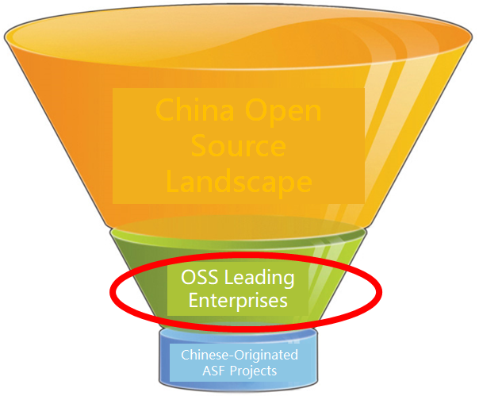
#### 2.3.1 全球市值最高的公司（包含阿里、腾讯）

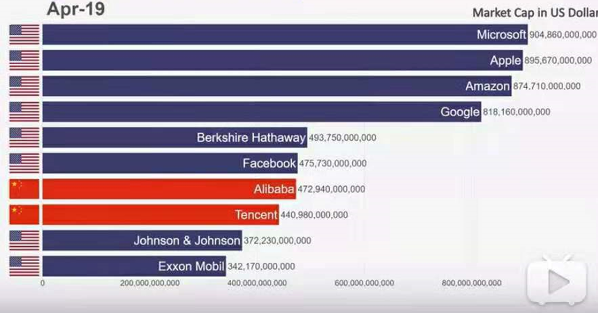

中国10大互联网上市公司 (市值 单位: 亿-美元)

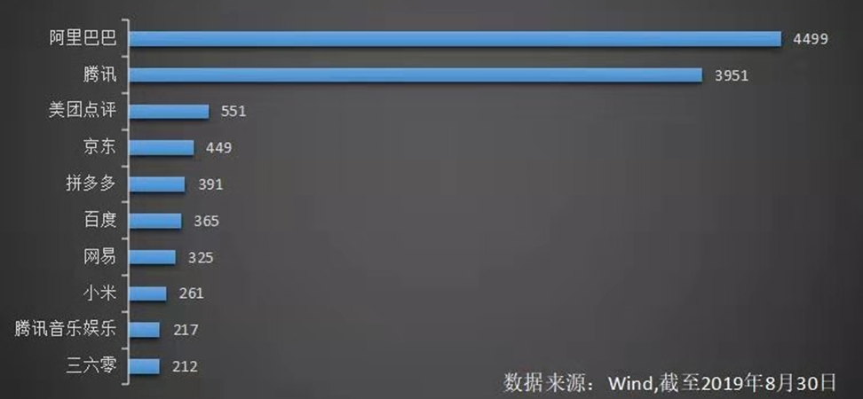

#### 2.3.2 七巨头
七大公司, 50 GitHub 账号, 2,800 项目（以下图表不分排名）
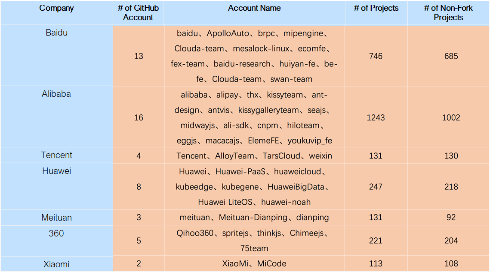
Source: InfoQ, Apr. 1st, 2019

#### 2.3.3 Top 10 GitHub accounts with most projects

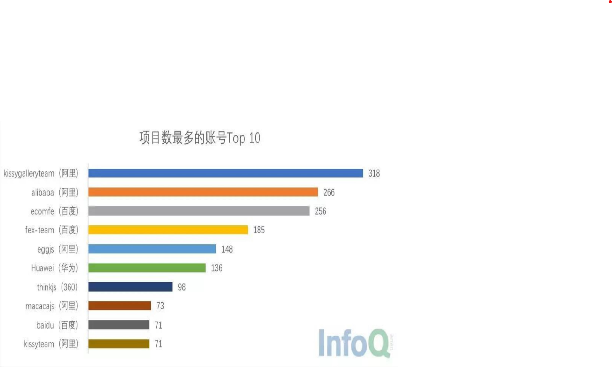

#### 2.3.4 Stars Top 10
排名前三的项目以及前十名的项目是前端项目
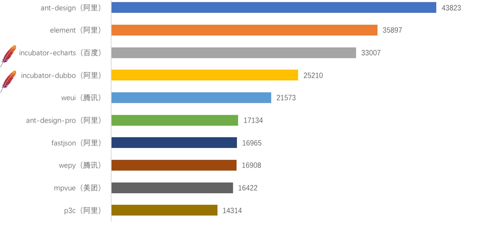
Source: InfoQ, Apr. 1st, 2019

#### 2.3.5 Contributors Top 10
以下统计仅累计了各企业有 GitHub 账号的贡献者
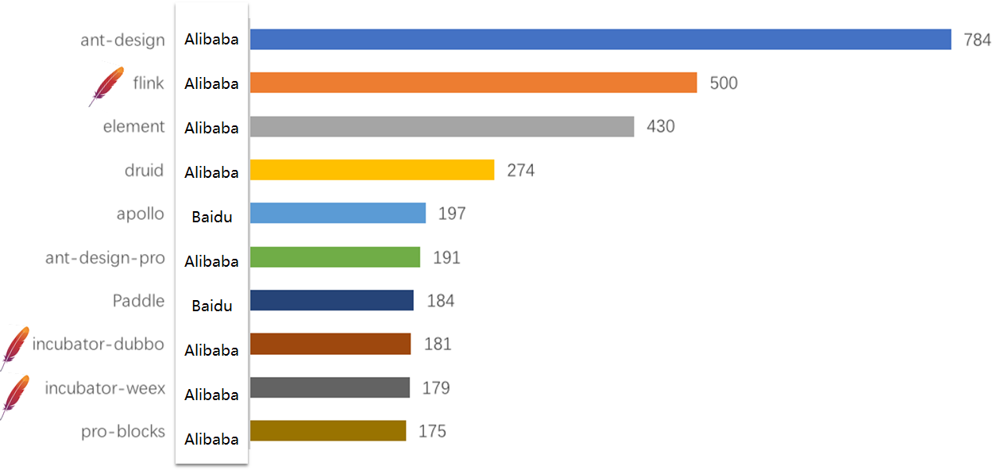
Source: InfoQ, Apr. 1st, 2019

#### 2.3.6 Commits Top 10
> 部分大公司会分叉 (fork) 一些知名的第三方项目并创建分支，但并未体现在 GitHub 的 fork 关系里，其中以阿里居多，如 AliOS-nodejs 项目。如此比较难以体现上游优先（upstream first）的开源社区理念。

> 以下这十 (10) 个项目有三 (3) 个都是 Apache 软件基金会项目（Flink 已被阿里收购），说明 Apache 软件基金会在开源领域领头羊的地位，同时也说明国内公司的确是把最好的项目捐献给了 Apache 基金会。

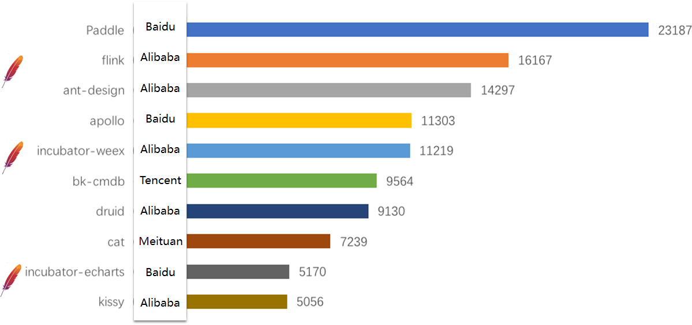
Source: InfoQ, Apr. 1st, 2019

#### 2.3.7 Most Favorable Projects
> 腾讯: 97/130 w. Star > 100
> 阿里巴巴: 237/1002 w. Star > 100
> 华为: 14/218  w. Star > 100

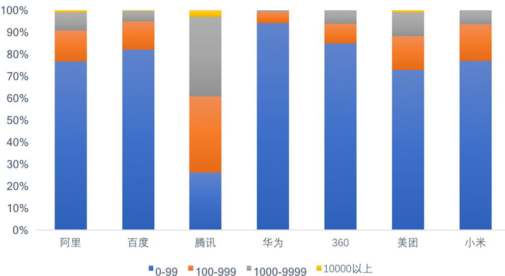
Source: InfoQ, Apr. 1st, 2019

> 华为拥有 218 个非分叉（fork）的项目数，但 Star 数 100 以上的项目仅有 14 个。可能是华为多以贡献者的身份参与第三方的底层项目，如 Linux、Kubernetes 等，这些在统计中未能体现；华为项目较少，基本是基础设施领域的项目，如 ServiceComb、CarbonData、LiteOS 等。

> 大前端（前端和移动开发）项目最多，在阿里、百度、360、美团中前 10 个几乎都占了一半。腾讯前 10 个项目里有 9 个是大前端领域的。

> 百度有 4 个是 AI 领域项目，在众多公司中别树一帜，包括 Paddle、Apollo 等都比较受欢迎。

> 小米有几个操作系统相关的项目较受欢迎。

#### 2.3.8 Recent Activitiy with most pushs
Push within 3 Months

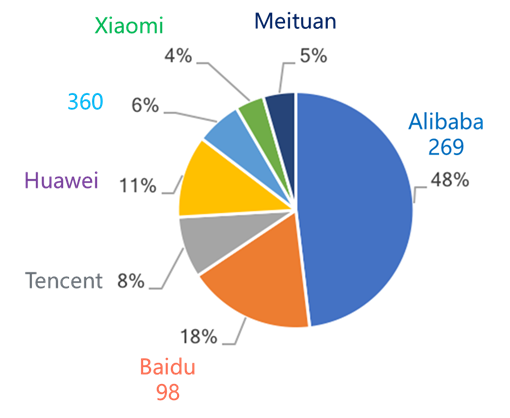
Source: InfoQ, Apr. 1st, 2019

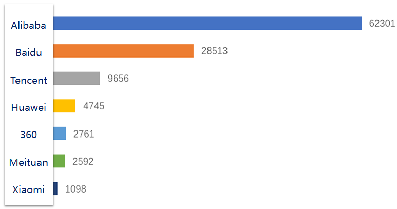
Source: InfoQ, Apr. 1st, 2019

### 2.4 国内开源新动向
来源：节录整理 2019 十大国产开源项目来势汹汹！CSDN 马超 2019年12月24日

#### 2.4.1 腾讯
腾讯在流式消息队列和操作系统等方面，技术积累较强，开源项目输出较多。
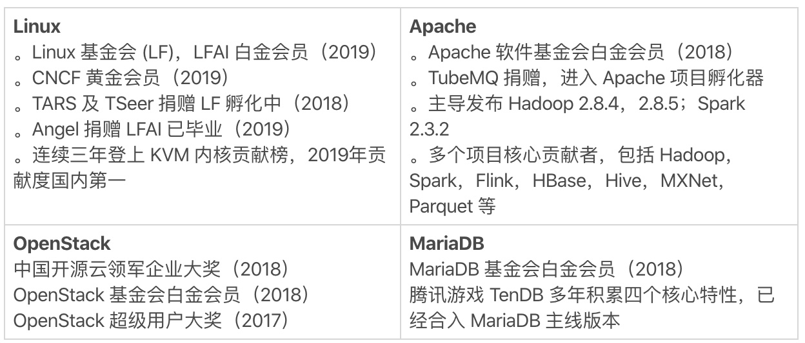

**腾讯高星开源项目简介**
- TubeMQ：https://GitHub.com/Tencent/TubeMQ/ 
> 是腾讯自研的分布式消息中间件系统（MQ），进行海量数据的存储和传输，其最高日交易量33万亿的数据。TubeMQ 项目在2019年底捐赠给 Apache 软件基金会，进入 Apache 孵化器。
- Tencent Tiny OS:  https://GitHub.com/Tencent/TencentOS-tiny/
> 这款物联网操作系统提供精简的 RTOS（实时操作系统）内核，而且正式发布时间相对较短，但是已经发展得比较成熟，并在内核控制和技术支持等方面做的相当不错。

#### 2.4.2 百度
百度目前在前端技术和 AI 技术，有一定的优势，这两方面输出项目比较多。

**百度高星开源项目简介**
- Echart: https://GitHub.com/apache/incubator-echarts
> 这个项目绝对是不太会美工的程序员福音，各种 Python 和 R 语言的接口比较完备，几行代码，就能达到一个不错的展示效果。
- PaddlePaddle: （GitHub地址：https://GitHub.com/PaddlePaddle）
> PaddlePaddle 是国内目前唯一能和 PyTorch、TensorFlow 分庭抗礼的国产深度学习平台。它集深度学习训练和预测框架、模型库、工具组件和服务平台为一体，拥有兼顾灵活性和高性能的开发机制、工业级的模型库、超大规模分布式训练技术、高速推理引擎以及系统化的社区服务等五大优势。百度还提供免费的在线 NOTEBOOK 环境供体验 https://aistudio.baidu.com/aistudio/index

#### 2.4.3 滴滴
> 在短短2年时间内，滴滴已将35个项目，进行了开源，包含领域有人工智能、小程序、智慧交通、中间件、前端框架、研发工具等。目前，在 GitHub 的 STAR 数已超过5万，全球组织排进前100名。

> 据统计，仅2019年，滴滴就有开源项目20个。与此同时，也产生了首个万星项目DoKit，滴滴还对许多如 Ceph、Link、Hadoop、Kylin 等开源软件做出积极的贡献。而且在2019年，滴滴被 CNCF 基金会，授予最高最终用户奖，这也是今年在亚洲唯一获奖的企业。2019年滴滴在开源方面收获颇丰。

**滴滴高星开源项目简介**
Dokit：DoKit https://GitHub.com/didi/DoraemonKit 也被移动开发者亲切称为哆啦A梦 Kit，这是一款功能齐全的客户端（ iOS 、Android、微信小程序 ）研发助手。能让每一个 App 快速接入常用的辅助开发工具、测试效率工具、视觉辅助工具，而且还支持在操作面板中，接入用户的非通用辅助功能，功能强大，便于扩展。 

cube-ui：cube-ui https://GitHub.com/didi/cube-ui/ ，它是滴滴基于 Vue 重构并开发了移动端组件库。每个模块都经过严格的测试，并且对于响应速度也有严格要求，真正做到了质量可靠、体验极致、扩展性强。

#### 2.4.4 RT-Thread
STAR 数也已经接近四千。
> RT-Thread: https://GitHub.com/SummerGGift/rt-thread）提到国产 IoT 操作系统，RT-Thread 是一个无论如何也绕不过去的标志。RT-Thread 在2006年初，就发布了第一版，经过十几年上亿台设备装机的技术沉淀，RT-Thread 社区也已俨然发展成为国内最强的嵌入式社区。

#### 2.4.6 TDEngine
TDengine 的 STAR 数已过万。
TDEngine: https://GitHub.com/taosdata/TDengine/ 请参阅《这位创造GitHub冠军项目的“老男人”，堪称10倍程序员本尊》、[《巨头垂涎却不能染指，loT 数据库风口已至》](http://mp.weixin.qq.com/s?__biz=MjM5MjAwODM4MA==&mid=2650730527&idx=1&sn=754c9f2f48c89224ab2a465726e82211&chksm=bea681cc89d108dae358d20ef314c2540b1f27d831b8558b5487abec62072e8d85d9c628b634&scene=21#wechat_redirect)

> 阿里的数据几乎在所有类别里都名列第一，有时甚至是其它公司之和，并且在社区化 / 开放等方面也做的不错。腾讯在2018年之前自有开源项目上数量较少。近年来，腾讯积极地加入/赞助各个开源基金会，也开源了一些高质量项目，收获了开发者的口碑。华为在自有开源方面显得有些保守，它的发力点更多在参与社区开源上，自家开源的很多项目多为操作系统和基础架构相关。

> 个别人和团队对整个公司的开源能产生重大影响，比如阿里的玉伯不仅是 Kissy 的创始人，也带领团队开发和维护 ant-design，撑起了阿里开源的大旗；百度有 Echarts 团队；腾讯有 Alloyteam；360 有奇舞团等。

> 需要加强的方面则是，这些最优秀的中国互联网公司，在底层关键项目上和国外还是存在较大差距，如 ant-design/element 等，只是 React、Vue 等前端框架的组件库，是其生态系统的一部分，而自己作为生态核心的项目在国内极少，因此，国内开源只是看着热闹，在实际作用方面，和国外差距极大。

> 另外，国内公司对于 GitHub 还没有做到物尽其用，在开源治理上还有所欠缺，我们看到有大量的 fork 项目，有大量的空项目，这些项目应该第一时间清理。对于不再维护的项目，GitHub 也提供了归档功能，国内公司应该善加利用。

### 2.5 新兴开源项目商业化

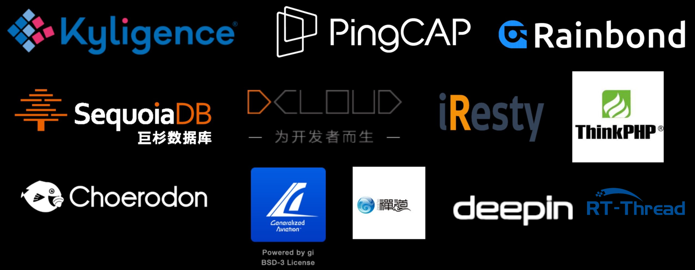

注：红薯 - 2019 年中国开源生态报告
https://gitee.com/oschina/open_source_2019 

- Choerodon http://choerodon.io/
> 猪齿鱼开源多云技术平台 - 多云应用技术集成平台
- DCloud 数字天堂网络技术 https://www.dcloud.io/ 
> 致力于推进HTML5发展，构建HTML5生态，提供快速开发应用的跨平台技术方案
- Deepin 武汉深度科技 https://www.deepin.org/
> 基于 Linux 的开源操作系统
- Generalized Aviation 泛化智能航空 https://www.gaas.dev/
> 为 VTOL-垂直起降 和无人机设计的开源自主飞行开发框架
- iResty 深圳支流科技 http://www.iresty.com/
> 微服务 API 管理平台
- Kyligence 上海跬智信息技术 https://kyligence.io/
> 提供一个基于 Apache Kylin 的 AI 增强的数据管理和分析平台，帮助分析师和数据工程师轻松从本地到多云架构上构建受控的数据服务
- PingCAP 北京平凯星辰科技发展 https://pingcap.com/
> 开源的新型分布式数据库公司
- Rainbond 北京好雨科技 https://www.rainbond.com/
> Rainbond 支撑企业应用的开发、架构、交付和运维的全流程，通过“无侵入”架构
> 无缝衔接各类企业应用，底层资源可以对接和管理IaaS、虚拟机和物理服务器
- RT-Thread 上海睿赛德电子科技 https://www.rt-thread.org/
> RT-Thread是一个集实时操作系统（RTOS）内核、中间件组件和开发者社区于一体的技术平台与物联网操作系统
- SequoiaDB 巨杉数据库 http://www.sequoiadb.com/
> 金融级分布式关系型数据库
- ThinkPHP 上海顶想公司 http://www.thinkphp.cn/
> 是基于 MVC 结构的开源 PHP框架，遵循 Apache 开源协议 v2 发布，是为了敏捷 Web 应用开发和简化企业应用开发而诞生的。
- ZenTao 禅道 https://www.zentao.net/
>禅道是灵活、敏捷、开源免费、研发项目管理软件

### 2.6 开源协议的使用

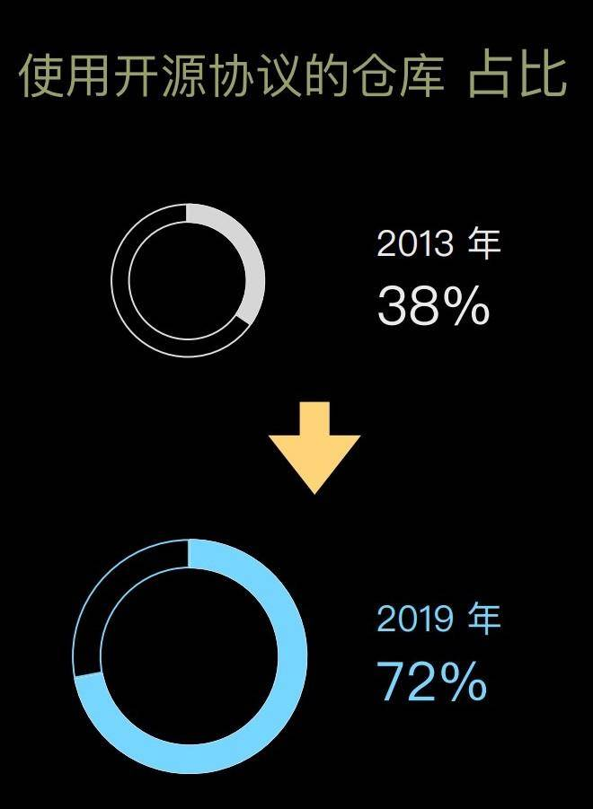

注：红薯 - 2019 年中国开源生态报告
https://gitee.com/oschina/open_source_2019 

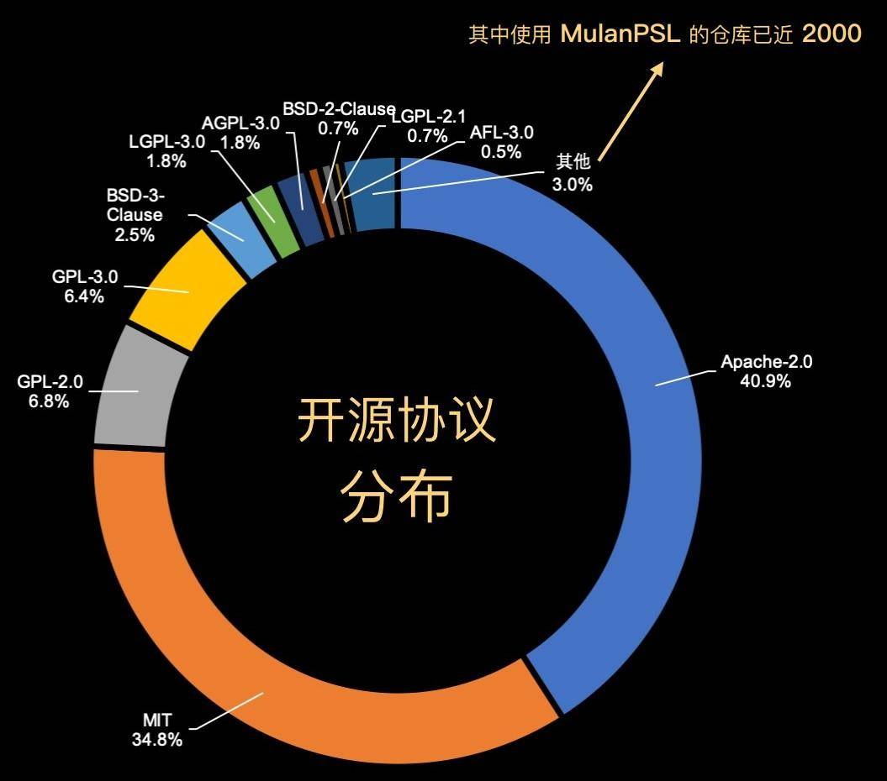

红薯 - 2019 年中国开源生态报告
https://gitee.com/oschina/open_source_2019 

## 三、积极参与国际开源基金会
- 我国在 Apache 软件基金会（ASF）有1家白金会员，1家黄金会员，3家白银会员
- 我国在 Linux 基金会（LF）有1家白金会员，3家黄金会员，27家白银会员
- 我国在 云原生基金会（CNCF）有3家白金会员，6家黄金会员，18家白银会员
- 我国在 OpenStack 基金会（OSF）有2家白金会员，8家黄金会员

### 3.1 Apache 软件基金会（ASF：Apache Software Foundation）
- 白金会员：腾讯云；
- 黄金会员：华为；
- 白银银会员：阿⾥云、百度、浪潮

### 3.2 Linux 基金会（LF：Linux Foundation）
- 白金会员：华为、腾讯 
- 黄金会员：阿⾥云、百度、微众银⾏ 
- 白银会员：浪潮、招商银⾏、中国移动、中兴、中国电信、中国联通、中国东信、中信集团、联想、平安科技、 上汽集团、新华三、京东、滴滴、时速云、同⽅云、联动优势、中标软件、中证信⽤、万向集团、远景视点、易 捷⾏云、点融、星科技、虚云科技、云途腾、真相科技…

### 3.3 云原生基金会 (CNCF：Cloud Native Computing Foundation）
- 白金会员：阿⾥云、华为、京东 
- 黄金会员：蚂蚁⾦服、百度、浪潮、KingSoft（港）、腾讯云、中兴 
- 白银银会员：中国移动、中国联通、平安科技、滴滴、灵雀云、巨杉数据库、EasyStack、云途腾、九州云、曙光云、时速云、优刻得、博云、才云、中国东信、同⽅有云、元鼎科技、睿云智合...

### 3.4 OpenStack 基金会（OSF：OpenStack Foundation） 
- 白金会员：华为、腾讯云 
- 黄金会员：九州云、中国移动、中国电信、中国联通、 中兴、易捷⾏云、烽⽕科技、浪潮

### 3.5 开源项目捐赠
国内共有多个项目贡献给国际顶级基金会（Linux 基金会/CNCF：13；Apache 软件基金会：9个顶级项目，10个孵化中）。可能有遗珠之憾，欢迎斧正！

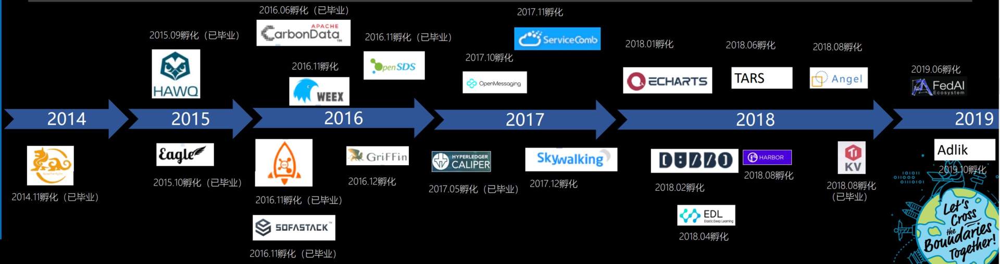

## 四、Apache 项目在中国的使用及发展
- Ted Liu, ApacheCon 2019, Las Vegas

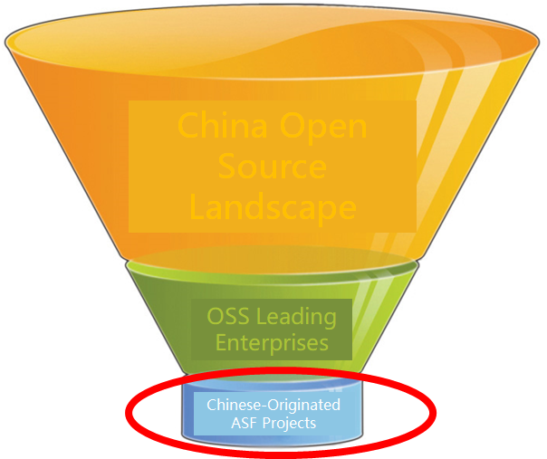
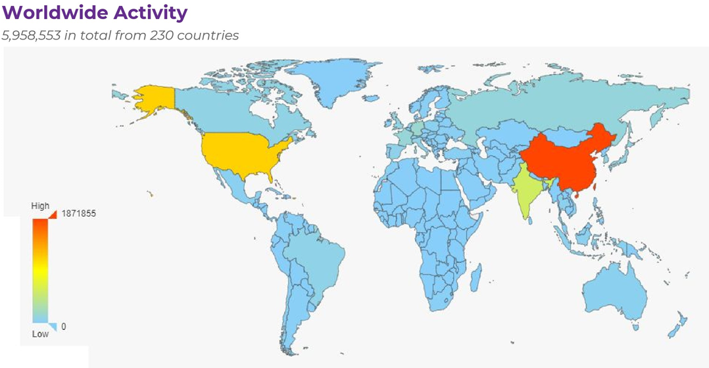

China – No. 1 in Download ASF Projects, source: ASF 2018 Annual Report

### 4.1 ASF 项目孵化器（Incubator） 

ASF 项目孵化器目前总共有 46个孵化项目。2014-2015年时，仅有 eBay 中国研究院的 3个项目（Eagle, Griffin, Kylin）参与了 ASF 孵化器并皆已毕业成为 TLP，时至 2019年，又新增了百度（孵化 4），阿里（3：TLP 2, 孵化 1），华为（3：TLP 2, 孵化 1），腾讯（孵化 1），请华大学（孵化 1），易观（孵化 1），深圳支流科技（孵化 1），Pivotal（TLP 1），个人/吴晟（TLP 1）等16个项目。可以看得出来雁行效应，由大企业（包含互联网巨头）以及国际企业在华研究机构带头，中小企业，初创企业、高校以及个人纷纷投入的可喜现象。

### 4.2 Apache 孵化项目（Incubating Project：Podling - 10）
- Apache APISIX（深圳支流科技捐赠)
> APISIX 是一个云原生微服务 API 网关，为所有 API 和微服务提供终极性能、安全性、开源和可扩展平台。
> APISIX is a cloud-native microservices API gateway, delivering the ultimate performance, security,open source and scalable platform for all your APIs and microservices.
- Apache BRPC（百度捐赠）
> brpc 是一个工业级 RPC 框架，用于构建可靠和高性能的服务。
> brpc is an industrial-grade RPC framework for building reliable and high-performance services.
- Apache DolphinScheduler（易观捐赠）
> DolphinSchedulingr 是一个分布式 ETL 调度引擎，具有强大的 DAG 可视化界面。
> DolphinScheduler is a distributed ETL scheduling engine with powerful DAG visualization interface..
Apache Doris（百度捐赠）
- Doris 是一个基于 MPP 的交互式 SQL 数据仓库，用于报告和分析。
> - Doris is a MPP-based interactive SQL data warehousing for reporting and analysis.
- Apache ECharts（百度捐赠）
> ECharts 是一个用 JavaScript 编写的图表和数据可视化库。
> - ECharts is a charting and data visualization library written in JavaScript.
- Apache IoTDB（请华大学捐赠）
> IoTDB 是一个数据存储，用于管理大量时间序列数据，例如工业应用中来自 IoT 传感器的时戳数据。
> - IoTDB is a data store for managing large amounts of time series data such as timestamped data from IoT sensors in industrial applications.
- Apache MesaTEE（百度捐赠）
> MesaTEE 是通用安全计算的框架。
> - MesaTEE is a framework for universal secure computing
- Apache ShardingSphere（华为捐赠）
> ShardingSphere 是一个透明分布式数据库中间件的生态系统，侧重于数据分片、分布式事务和数据库编排。
> - ShardingSphere is an ecosystem of transparent distributed database middleware, focusing on data sharding, distributed transaction and database orchestration.
- Apache TubeMQ (腾讯捐赠）
> TubeMQ 专注于大数据场景中的高性能存储和海量数据传输
> - TubeMQ focuses on high-performance storage and transmission of massive data in big data scenarios
- Apache Weex（阿里捐赠）
> Weex 是构建移动跨平台高性能 UI 的框架。
> - Weex is a framework for building Mobile cross-platform high performance UI.

### 4.3 Apache 顶级项目（Top Level Project：TLP - 9）
- Apache CarbonData（华为捐赠）
> Apache CarbonData 是一种新的 Apache Hadoop 原生文件格式，使用高级列存储、索引、压缩和编码技术加快交互式查询，以提高计算效率，进而有助于加快查询速度超过 PB 字节的数据。
> - Apache CarbonData is a new Apache Hadoop native file format for faster interactive query using advanced columnar storage, index, compression and encoding techniques to improve computing efficiency, in turn it will help speedup queries an order of magnitude faster over PetaBytes of data.
- Apache Dubbo（阿里捐赠）
> Dubbo 是一个高性能、轻量级、基于 Java 的 RPC 框架。
> - Dubbo is a high-performance, lightweight, java based RPC framework.
- Apache Eagle（eBay 捐赠）
> Apache Eagle 是一种开源分析解决方案，用于在大数据平台上即时识别安全性和性能问题，例如 Apache Hadoop、Apache Spark。它分析数据活动、Yarn 应用程序、jmx 指标和守护进程日志等，提供最先进的警报引擎，以识别安全漏洞、性能问题并显示洞察。
> - Apache Eagle is an open source analytics solution for identifying security and performance issues instantly on big data platforms, e.g. Apache Hadoop, Apache Spark. It analyzes data activities, Yarn applications, jmx metrics, and daemon logs etc., provides state-of-the-art alert engine to identify security breach, performance issues and shows insights.
- Apache Griffin（eBay 捐赠） 
> Griffin 是一款开源的数据质量解决方案，适用于流式处理和批处理数据模型中任何规模的分布式数据系统。Griffin 支持各种数据质量维度，如准确性、完整性、有效性、及时性、分析。
> - Griffin is a open sourced data quality solution for distributed data systems at any scale in both streaming and batch data model. Griffin supports a wide variety of data quality dimensions as accuracy, completeness, validity, timeliness, profiling.
- Apache HAWQ（Pivotal 捐赠）
> HAWQ 是 Hadoop 分析引擎上的高级企业级 SQL，它围绕从 Pivotal Greenplum 数据库演变而来的稳健且高性能的大规模并行处理 （MPP） SQL 框架构建而成。
> - HAWQ is an advanced enterprise SQL on Hadoop analytic engine built around a robust and high-performance massively-parallel processing (MPP) SQL framework evolved from Pivotal Greenplum Database.
- Apache Kylin（eBay 捐赠）
> Kylin 是一个分布式且可扩展的 OLAP 引擎，基于 Hadoop 构建，支持非常大的数据集。
> - Kylin is a distributed and scalable OLAP engine built on Hadoop to support extremely large datasets.
- Apache RocketMQ（阿里捐赠）
> RocketMQ 是一款快速、低延迟、可靠、可扩展、分布式、易于使用的面向消息的中间件，尤其适用于处理大量流数据。
> - RocketMQ is a fast, low latency, reliable, scalable, distributed, easy to use message-oriented middleware, especially for processing large amounts of streaming data.
- Apache ServiceComb（华为捐赠）
> ServiceComb 是一个微服务框架，它提供了一组工具和组件，使云应用程序的开发和部署更加容易。
> - ServiceComb is a microservice framework that provides a set of tools and components to make development and deployment of cloud applications easier.
- Apache Skywalking（个人：吴晟捐赠）
> SkyWalking 是一个 APM（应用程序性能监视器），尤其适用于微服务、云本机和基于容器的体系结构系统。也称为分布式跟踪系统。它提供了一种自动检测应用程序的方法：无需更改目标应用程序的任何源代码；以及具有极高效率的流式处理模块的收集器。
> - Skywalking is an APM (application performance monitor), especially for microservice, Cloud Native and container-based architecture systems. Also known as a distributed tracing system. It provides an automatic way to instrument applications: no need to change any of the source code of the target application; and an collector with an very high efficiency streaming module.

## 五、中国开源项目融入全球开源社区
开源文化与价值的传递研究报告（The Transimission of Values and Culture in Open Source）
By Sharan Foga, Vice President, Community Development, Apache Software Foundation

### 5.1 霍夫斯泰德文化六维度分析
霍夫斯泰德文化六维度分析
Hofstede 6-Dimenson Culture Analysis
1. PDI：权力距离（Power Distance Index）
2. IDV：个人主义/集体主义（Individualism vs Collectivism） 
3. MAS：男性化与女性化（Masculinity vs Femininity）
4. UAI：不确定性的规避（Uncertainty Avoidance Index）
5. LTO：长期取向与短期取向（Long Term Orientation vs Short Term Orientation）
6. IND：自身放纵与约束（Indulgence vs Restraint）

霍夫斯泰德文化六维度分析（中国）

霍夫斯泰德文化六维度分析（美国）

- 权力距离：中国人更尊重权威，更接受组织内权力的不平均分配。(中: 80，美: 40）
- 个人主义/集体主义：中国人更重视群体与族群关系，而非个人。(中: 20，美: 91）
- 不确定性的规避：中国人对于不确定性高及反常的行为和意见比较宽容，规章制度少，在哲学、宗教方面容许各种不同的主张同时存在。(中: 30，美: 46）
- 长期取向与短期取向：中国人（以及东亚高经济发展地区）追求高道德满足，对延迟其物质、情感、社会需求的满足所能接受的程度较高。(中: 87，美: 26）
- 自身放纵与约束：中国人对自身放纵社会整体对自身约束力比较大。(中: 24，美: 68）
- 男性化与女性化：代表男性的品质如竞争性、独断性更多,还是代表女性的品质如谦虚、关爱他人更多,以及对男性和女性职能的界定。中美双方的差距不大。(中: 66，美: 62）

从以上的文化六维度分析来看，中美双方文化的差距比较大，那么这样子的差距对于源自中国的开源项目进入 Apache 软件基金会，是否会有不适应的问题呢？我们看看以下的分析。

### 5.2 本研究报告分析的项目（4/30/2019）

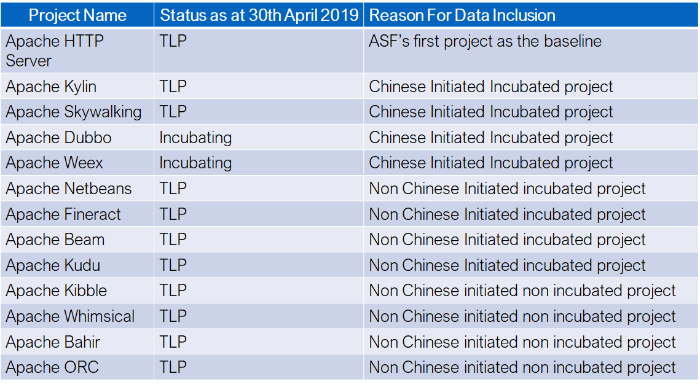

本研究报告运用了 Apache 自身的语义分析项目 Apache Kibble，对十三（13）个项目进行了分析，其中有 ASF 创始项目 HTTP Server，4个源自中国的项目：Apapche Kylin（已完成孵化的毕业项目），Apache Skywalking（已完成孵化的毕业项目），Apache Dubbo（当时孵化中），Apache Weex（孵化中）；4个非源自中国的已完成孵化的毕业项目：Apache Netbeans，Apache Fineract，Apache Beam，Apache Kudu；4个非源自中国的未经孵化直接成为顶级项目：Apache Kibble，Apache Whimsical，Apache Bahir，Apache ORC。

### 5.3 Apache Kibble Data Analysis
- Indicator 1: Baseline Pony Factor Codebase
- Indicator 2: Baseline Pony Factor – Email
- Indicator 3: Baseline Contributor Experience
- Indicator 4: Baseline Contributor Retention Codebase
- Indicator 5: Baseline Contributor Retention Email
- Indicator 6: Baseline Sentient Analysis
- Indicator 7: Baseline Sentient Analysis Over Time
- Indicator 8: Baseline Key Phrase Extraction

### 5.4 论文结论
令人讶异的是，经过分析，Apache 孵化器在将 Apache 文化嵌入中国贡献的项目中是非常成功的。以下是源自中国的开源项目在 Apache 孵化中/后的表现分析。这些源自中国的项目：
- 最充分地承认他们的贡献者的功绩
- 最成功地吸引新的贡献者到他们的项目
- 已经适应了使用 Apache 文化语言
- 已采用并大量使用“+1”共识指标
- 关键是只有孵化的项目使用“+1”指标（其它非孵化项目很少或不使用）
注：ASF 采取共识决（尽量少用多数决），当需要表达意见或投票时，+1 代表了非常支持，0 代表了不反对（不投票亦视为不反对），-1 代表了不支持（需要提出反对理由，最好能提出替代方案）。

## 六、本篇结语

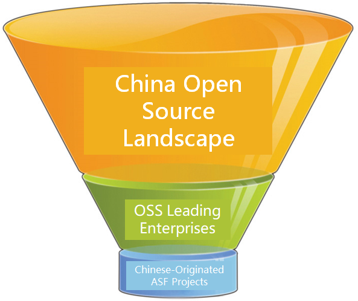

- 大企业（尤其是互联网企业）领头羊效应
- 大前端及移动端项目较多
- 项目优化及补充较多，创新项目以及核心项目较少
- 新创企业开源商业化逐渐崭露头角
- 开源治理逐步受到重视，其中开源协议的使用大幅增加
- 国内有志于贡献开源者缺乏时间、精力与动力投入开源（996）
- 中国文化及信念非常适合由下至上的开源社区理念
- 由政府及大企业主导的开源协议、开源项目托管平台以及开源基金会的发展，值得关注

## 七、参考资料
- 2018中国开源年度报告-洞察篇
- GitHub Octoverse Report ( October 1, 2018 to Sept 30, 2019)
- GitHub年度报告（AI前线）
- 中国开源产业发展现状 ：中国信通院云计算与大数据研究所所长-何宝宏（COSCon'19 主题演讲）
- The Rise of Open Source Software (and Apache Projects) in China - Ted Liu
- 红薯 - 2019 年中国开源生态报告 https://gitee.com/oschina/open_source_2019 
- CSDN 2018-2019 中国开发者调查报告
- InfoQ 2019 中国互联网公司开源项目调研报告
- CSDN 2019 十大国产开源项目来势汹汹！